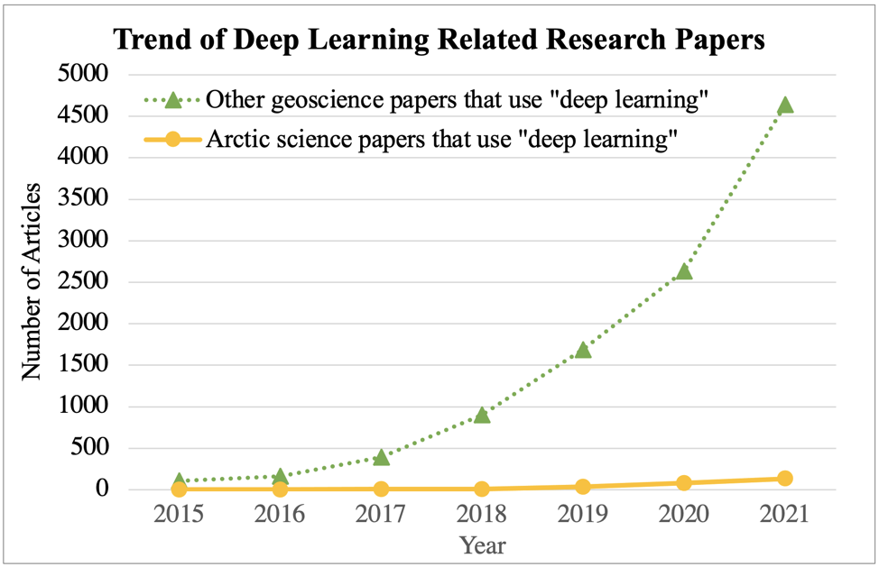

# Trends of Deep Learning Related Research in Arctic Science and Geosciences

## 1. Goal

The goal of this research is to discover the recent trends of research that is conducted with the help of (or related to) deep learning technology in the research area of arctic science and geoscience. The raw statistics of the trends are retrieved effectively, leveraging Google Scholar search engine and a strategy of refining search domain introduced by our own. 

## 2. Method

### 2.1 Identify geoscience related journals

To produce the more accurate statistics of trends and make the whole process more efficient, we introduced a strategy that narrows down the research area by selecting related journals before performing the searches, rather than iterating all the journals or articles in one or more research publication database. Specifically, we referred to a comprehensive review paper ([Reichstein et al., 2019](#ref1)) that summarized the recent adoption of deep learning on earth system science research. Starting from the journals[^1] listed in the reference of the paper, we further expanded the journal list by exploiting a journal ranking database [Scimagojr](https://www.scimagojr.com/journalrank.php), with the following steps:

1.	Find all subcategories in database Scimagojr that cover the journals[^1] referred by the review paper. See the selected subcategories in [Appendix A-1](#apdx1). 
2.	For each subcategory, find out all journals that have a rank index higher than 1 (SJR > 1). 
3.	Merge all the collected journals from each subcategory and remove any duplications. 

We finally retrieved 232 journals from the above steps. See full list of the journals in [Appendix A-2](#apdx2).

### 2.2 Retrieve and count papers published with and without an Arctic focus

With the API of Google Scholar, and specifying the keyword, journal name, and publication year (see [sample query](#sample_q) below), we counted the number of articles of each selected journals in each year from 2015 to 2021 to build the statistics that present the trends of research on arctic science and geoscience. By specifying the keywords as "deep learning"+"arctic", we retrieved the trend of research on arctic related to deep learning. Since all the selected journals are categorized to be related to geoscience, the trend of research on geoscience can be obtained using keywords "deep learning" alone. 

[^1]: we manually selected the journals that are relevant to earth science or geoscience.

<a name="sample_q"></a>
#### A Sample Query
```
https:/scholar.google.com/scholar?
as_q="deep learning" "arctic"&
as_publication="Remote Sensing of Environment"&
as_ylo=2021&as_yhi=2021&hl=en-US
```
After URL encoding, the query is finally formatted as follows:
```
https:/scholar.google.com/scholar?as_q=%22deep%20learning%22%20%22arctic%22&as_publication=%22Remote%20Sensing%20of%20Environment%22&as_ylo=2021&as_yhi=2021&hl=en-US
```

## 3. Results

The final results are presented in [table 1](#tab1). Using the keyword "deep learning", we obtain the trend of utilizing deep learning in geoscience research, the numbers are in column "**Papers using 'deep learning' in the geoscience domains**". Similarly, we obtain the numbers in column "**Arctic science papers that uses 'deep learning'**" using keywords "deep learning"+"arctic". By calculating the difference between the above two columns, we obtained the number in column "**Other geoscience papers that uses 'deep learning'**". 

<a name="tab1"></a>
|    |Papers using "deep learning" in the geoscience domains|Arctic science papers that uses "deep learning"|Other geoscience papers that uses "deep learning"|
|----|----:|----:|----:|
|2015|  110|    2|  108|
|2016|  166|    1|  165|
|2017|  400|    9|  391|
|2018|  912|   10|  902|
|2019| 1731|   36| 1695|
|2020| 2722|   81| 2641|
|2021| 4774|  133| 4641|

_Table 1. Numbers of deep learning related arcticles in arctic science and geosciences during 2015-2021_  
<br/>

To provide a better intuition of the results, we visualized the numbers of the second and the third column together in [figure 1](#fig1).

<a name="fig1"></a>

_Figure 1. Trends of deep learning related research in arctic science and geosciences during 2015-2021_  
<br/>

## 4. Potential issues and uncertainties

In this research, although we refined the research area and adopted very specific keywords while performing the search, the search results might  not exactly match our intention. For example, there might be a proportion of result arcticls that simply mention "deep learning" in the text but do not directly use deep learning while conducting the research. Thus, the produced statistics might be a little higher than it should be. However, the trends on arctic science and geoscience are still valid to be compared, supposing they share the similar uncertainty rate. 

## References
<a name="ref1"></a>Reichstein, M., Camps-Valls, G., Stevens, B., Jung, M., Denzler, J., & Carvalhais, N. (2019). Deep learning and process understanding for data-driven Earth system science. *Nature, 566(7743)*, 195-204.

## Appendix

<a name="apdx1"></a>
### A-1. Selected Subject Category list in [Scimagojr](https://www.scimagojr.com/journalrank.php)

Atmospheric Science  
Computers in Earth Sciences  
Earth and Planetary Sciences (miscellaneous)  
Earth-Surface Processes  
Environmental Science (miscellaneous)  
Geography, Planning and Development  
Geophysics  

<a name="apdx2"></a>
### A-2. Full Journal List
AAPG Bulletin  
Acta Geotechnica  
Advanced Sustainable Systems  
Advances in Atmospheric Sciences  
Advances in Climate Change Research  
Aeolian Research  
African Affairs  
Agricultural and Forest Meteorology  
Agricultural Water Management  
Ambio  
American Journal of Science  
American Mineralogist  
Annals of the American Association of Geographers  
Anthropocene  
Antipode  
Applied Catalysis B: Environmental  
Applied Geography  
Aquaculture, Economics and Management  
Atmospheric Chemistry and Physics  
Atmospheric Environment  
Atmospheric Environment: X  
Atmospheric Measurement Techniques  
Atmospheric Research  
Big Earth Data  
Biogeochemistry  
Biogeosciences  
BMC Ecology  
Boundary-Layer Meteorology  
Building and Environment  
Bulletin of Earthquake Engineering  
Bulletin of the American Meteorological Society  
Bulletin of the Seismological Society of America  
Business Strategy and the Environment  
Cambridge Journal of Regions, Economy and Society  
Capitalism, Nature, Socialism  
Carbon Balance and Management  
Catena  
China Journal  
China Quarterly  
City  
Climate and Development  
Climate Dynamics  
Climate Policy  
Climate Risk Management  
Climate Services  
Climatic Change  
Cold Regions Science and Technology  
Computers, Environment and Urban Systems  
Contributions to Mineralogy and Petrology  
Cryosphere  
Current Climate Change Reports  
Current Issues in Tourism  
Current Opinion in Environmental Sustainability  
Democratization  
Dialogues in Human Geography  
Earth and Planetary Science Letters  
Earth Interactions  
Earth Surface Dynamics  
Earth Surface Processes and Landforms  
Earth System Dynamics  
Earth System Science Data  
Earth-Science Reviews  
Earth's Future  
Earthquake Engineering and Structural Dynamics  
Earthquake Spectra  
Ecological Economics  
Economic Geography  
Economic Geology  
Ecosystem Services  
Egyptian Journal of Remote Sensing and Space Science  
Elementa  
Elements  
Energy for Sustainable Development  
Environment and Behavior  
Environment and Planning A  
Environment and Planning C: Politics and Space  
Environment and Planning D: Society and Space  
Environment and Society: Advances in Research  
Environment and Urbanization  
Environmental Impact Assessment Review  
Environmental Innovation and Societal Transitions  
Environmental International  
Environmental Politics  
Environmental Research  
Environmental Research Letters  
Environmental Reviews  
Environmental Science and Policy  
Environmental Science: Nano  
European Planning Studies  
European Urban and Regional Studies  
Frontiers in Earth Science  
Frontiers in Environmental Science  
Frontiers in Marine Science  
Geobiology  
Geochemistry, Geophysics, Geosystems  
Geographical Journal  
Geography Compass  
Geomorphology  
Geophysical Journal International  
Geophysical Research Letters  
Geophysics  
Geoscience Frontiers  
Geoscience Letters  
Geoscientific Model Development  
Geotechnique  
GIScience and Remote Sensing  
Global Biogeochemical Cycles  
Global Change Biology  
Global Environmental Change  
GPS Solutions  
Groundwater for Sustainable Development  
Health and Place  
Holocene  
Hydrology and Earth System Sciences  
IEEE Journal of Selected Topics in Applied Earth Observations and Remote Sensing  
IEEE Transactions on Geoscience and Remote Sensing  
International Journal of Applied Earth Observation and Geoinformation  
International Journal of Climatology  
International Journal of Earth Sciences  
International Journal of Geographical Information Science  
International Journal of Housing Policy  
International Journal of Life Cycle Assessment  
International Journal of Sustainable Transportation  
International Journal of Tourism Research  
Island Studies Journal  
ISPRS Journal of Photogrammetry and Remote Sensing  
Journal of Advances in Modeling Earth Systems  
Journal of African Business  
Journal of Applied Meteorology and Climatology  
Journal of Applied Volcanology  
Journal of Asian Earth Sciences  
Journal of Cleaner Production  
Journal of Climate  
Journal of Economic Geography  
Journal of Environmental Education  
Journal of Environmental Informatics  
Journal of Environmental Sciences  
Journal of Flood Risk Management  
Journal of Geodesy  
Journal of Geographical Sciences  
Journal of Geophysical Research  
Journal of Geophysical Research: Solid Earth  
Journal of Geotechnical and Geoenvironmental Engineering - ASCE  
Journal of Glaciology  
Journal of Hydrology: Regional Studies  
Journal of Hydrometeorology  
Journal of Industrial Ecology  
Journal of Petrology  
Journal of Planning Literature  
Journal of Quaternary Science  
Journal of Regional Science  
Journal of Rural Studies  
Journal of Space Weather and Space Climate  
Journal of Sustainable Tourism  
Journal of the American Planning Association  
Journal of Transport and Land Use  
Journal of Transport Geography  
Journal of Travel Research  
Journal of Volcanology and Geothermal Research  
Journals of the Atmospheric Sciences  
Land Degradation and Development  
Land Use Policy  
Landscape Ecology  
Long Range Planning  
Marine and Petroleum Geology  
Marine Policy  
Maritime Policy and Management  
Meteoritics and Planetary Science  
Meteorological Monographs  
Mineralium Deposita  
Mobilities  
Monthly Weather Review  
Natural Hazards and Earth System Sciences  
Nature Climate Change  
Nature Geoscience  
Nature Sustainability  
New Political Economy  
npj Climate and Atmospheric Science  
Ocean Modelling  
Organization and Environment  
Palaeogeography, Palaeoclimatology, Palaeoecology  
Paleoceanography and Paleoclimatology  
Physics of the Earth and Planetary Interiors  
Planning Theory  
Planning Theory and Practice  
Political Geography  
Population and Environment  
Population, Space and Place  
Proceedings of the Royal Society B: Biological Sciences  
Progress in Earth and Planetary Science  
Progress in Human Geography  
Progress in Physical Geography  
Progress in Planning  
Quarterly Journal of the Royal Meteorological Society  
Quaternary Geochronology  
Radiocarbon  
Regional Studies  
Remote Sensing  
Remote Sensing in Ecology and Conservation  
Remote Sensing of Environment  
Reviews of Geophysics  
Science China Earth Sciences  
Science China Life Sciences  
Scientific Online Letters on the Atmosphere  
Seismological Research Letters  
Social and Cultural Geography  
Socio-Economic Planning Sciences  
Soil and Tillage Research  
Solid Earth  
Space Weather  
Surveys in Geophysics  
Sustainability Science  
Sustainable Cities and Society  
Tectonics  
Tectonophysics  
Tellus, Series A: Dynamic Meteorology and Oceanography  
Tourism Geographies  
Tourism Review  
Transactions of the Institute of British Geographers  
Transport Policy  
Transportation Research, Part D: Transport and Environment  
Urban Climate  
Urban Geography  
Urban Studies  
Water Resources and Industry  
Water Resources and Rural Development  
Weather and Climate Extremes  
Weather and Forecasting  
Weather, Climate, and Society  
Wiley Interdisciplinary Reviews: Climate Change  
Wiley Interdisciplinary Reviews: Energy and Environment  
World Development  
